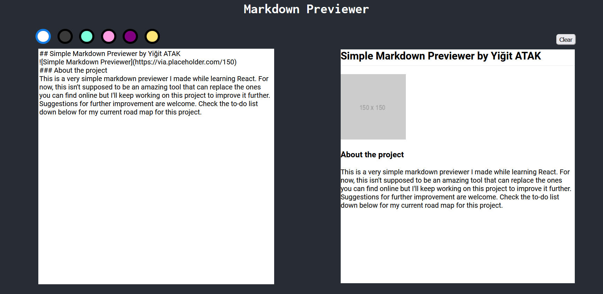

## Simple Markdown Previewer by Yiğit Atak

### About the project
This is a very simple markdown previewer I made while learning React. For now, this isn't supposed to be an amazing tool that can replace the ones you can find online but I'll keep working on this project to improve it further. Suggestions for further improvement are welcome. Check the to-do list down below for my current road map for this project.

### Built with
This project uses multiple libraries and frameworks. All the libraries and frameworks are subject to change as development continues.
- [React](https://tr.reactjs.org/)
- [Markdown-It](https://github.com/markdown-it/markdown-it)
- [react-lineicons](https://www.npmjs.com/package/react-lineicons)
- [react-beautiful-dnd](https://github.com/atlassian/react-beautiful-dnd)

### Getting Started
You need the following tools for installation:
- [NPM](https://www.npmjs.com/)

#### Installation
1. Clone the repo.
`git clone https://github.com/Arintia/markdown-previewer.git`
2. Navigate to the newly created folder.
`cd markdown-previewer`
3. Install all the dependencies.
`npm i`
4. Boot it up.
`npm start`
5. Happy coding!

### Usage
This project can be used for when you're writing out a markdown file for your own project. Have you ever wondered how your markdown roughly looks like before pushing your commit? Well, look no further! You can also customize the background and choose among a few colors. 

### Roadmap
- [ ] Refactor code to be a lot clearer
- [X] Turn color buttons into a component
- [X] Add more background color options
- [X] Work on the front-end design to make the app more visually appealing
- [X] Add a footer
- [ ] Custom MD parser allowing for more customization and a preview that looks a lot better
- [ ] Responsive design, currently the app is horrible on different viewports

### Contributing
Contributions are what make the open source community such an amazing place to learn, inspire, and create. Any contributions you make are **greatly appreciated**.

If you found a bug or if you have a suggestion, feel free to fork this repo and create a pull request. Also feel free to open an issue and I'll get to it when I have time! If you want to work on your enhancement on your own, here's how you can achieve that:

1. Fork the project
2. Create a branch (`git checkout -b feature/SomeNewFeature`)
3. Commit your changes after you're done (`git commit -m "Add Some New Feature"`)
4. Push your commit (`git push origin feature/SomeNewFeature`)
5. Open a pull request
6. Wait for me to review it and merge it or suggest changes!

### License
This project is distributed under the [MIT](https://choosealicense.com/licenses/mit/) license. 

### Contact
You can connect with me on [LinkedIn](https://www.linkedin.com/in/yigitatak/)